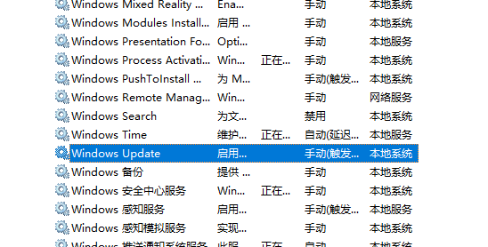
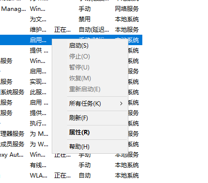
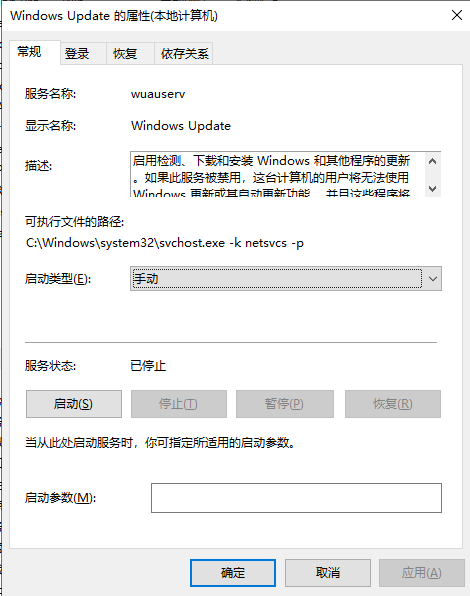
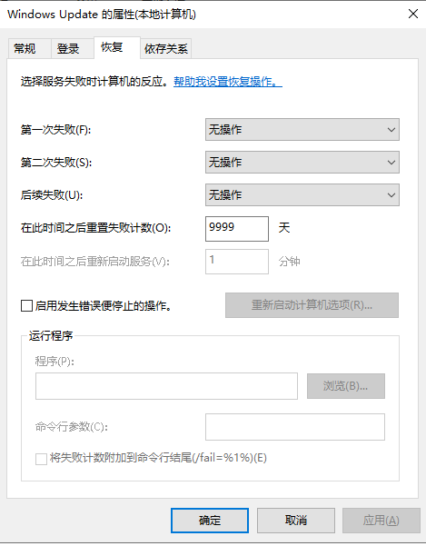

# Close Useless Services

## 关闭某功能的基本思路

Windows 关闭某些服务(功能)的基本思路如下:
- 服务(`services.msc`)
- 计划任务(`taskschd.msc`)
- 组策略(`gpedit.msc`)
- 注册表(`regedit`)

本节所说的`运行`是指使用组合键`Win`和`r`，输入命令并回车运行之。

### 禁用服务

1. 运行 `services.msc`

2. 鼠标左击选中某个服务

3. 鼠标右击打开服务操作菜单

4. 点`属性(properties)`

5. 选择`常规`面板, 先**停止**该服务，再将**启动类型**改为`手动`或`禁用`.  手动是可以选择手动启动或根据某些事件触发服务运行, 禁用则更为彻底

6. 选择`恢复`面板. 这里的设置是为了防止服务停止后再自动启动. 设置如下:
- 第一次失败: 无操作
- 第二次失败: 无操作
- 后续失败: 无操作
- 在此时间之后重置失败计数: 9999

7. 点击下方的`应用`、`确定`.

### 关闭计划任务

### 修改组策略

### 修改注册表

## 关闭 Windows 自动更新
