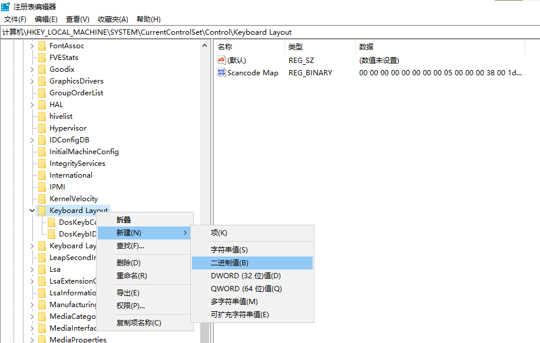
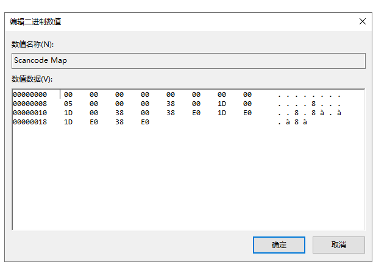
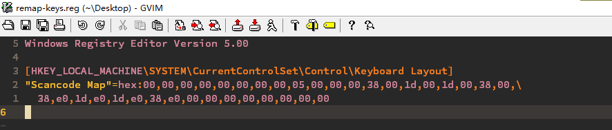

<!-- vim-markdown-toc GFM -->

* [Remap Keys for Windows](#remap-keys-for-windows)
    * [通过修改注册表重映射键位](#通过修改注册表重映射键位)
        * [重映射说明](#重映射说明)
        * [重映射步骤](#重映射步骤)
        * [取消重映射](#取消重映射)
        * [注册表导出与导入](#注册表导出与导入)
            * [导出](#导出)
            * [导入](#导入)

<!-- vim-markdown-toc -->

# Remap Keys for Windows

## 通过修改注册表重映射键位

### 重映射说明

这里做的重映射如下:
- `左 Ctrl` 映射为 `左 Alt`
- `左 Alt` 映射为 `左 Ctrl`
- `右 Ctrl` 映射为 `右 Alt`
- `右 Alt` 映射为 `右 Ctrl`

即交换键盘上 `Ctrl` 和 `Alt` 的键位, 因为 `Ctrl` 使用的频率比 `Alt` 要高。

键位和键码对应关系:

| 键位      | 键码    |
|-----------|---------|
| `左 Ctrl` | `00 1D` |
| `左 Alt`  | `00 38` |
| `右 Ctrl` | `E0 1D` |
| `右 Alt`  | `E0 38` |

用改注册表的方式重映射键位较麻烦，需查询键位对应的键码, 但好处是不用额外下载软件，性能更好一些。

### 重映射步骤

1. `Win` + `r`, 输入 regedit, 回车运行并授权。

2. 定位注册表关于修改键位的路径, 可在顶部地址栏输入下面内容并回车:
```
计算机\HKEY_LOCAL_MACHINE\SYSTEM\CurrentControlSet\Control\Keyboard Layout
```

3. 右击注册表项 `Keyboard Layout` -> 新建 -> 二进制值 -> 命名为 `Scancode Map` -> 双击进入编辑数据。



4. 数据说明和编辑. 数值数据的内容是十六进制的数字，`A` 到 `F` 分别对应十进制的 `11` 到 `15`. 这里把 2 个数字称为一组(字节)，把 4 组数字称为一个映射.



- 前 2 个映射对应第 1 行，内容都是 `0`，这个用来标记开始，是固定的。
- 第 2 行第 1 个映射的第 1 组 `05` 表示后面键位映射的个数加上 1, 后面有 4 个映射, 所以这里是 `4+1=5`。
- 第 2 行第 1 个映射剩下的 3 组值都为 `0`, 是固定的。
- 这里的数据是小端序, 也即从低位开始排列, 比如 `12 34` 填入其中应该是 `34 12`, 即先填充低位再填充高位。
- 第 2 行第 2 个映射是真正的键位映射, 4 组数字组成一个键位映射, 前 2 组数字对应新键的键码, 后 2 组数字对应旧键的键码, 即把后面的键位映射成前面的。`00 38` 是 `左 Alt` 键的键码, `00 1D` 是 `左 Ctrl`, 就是把原来 `左 Ctrl` 键映射成 `左 Alt`。由上面说的小端序，故这里是低位优先，反向填充。
- 剩下的 3 个映射可类比分析，不再赘述。
- 键位映射完成后，可在末尾再添加 2 个映射，内容都是用 `0` 填充，来表示映射结束。上图没有添加。

5. 重启生效

### 取消重映射

删除上面新建的 `Scancode Map` 后重启即可。

### 注册表导出与导入

如果之前已在其它电脑通过修改注册表做了键位映射，则只需要从旧电脑导出对应的注册表项然后导入。

#### 导出

1. 执行导出键位映射的注册表项命令:

```cmd
reg export "HKEY_LOCAL_MACHINE\SYSTEM\CurrentControlSet\Control\Keyboard Layout" remap-keys.reg
```

2. 使用记事本或其它文本编辑器打开 `remap-keys.reg` 文件，只保留 `Scancode Map` 相关的数据，其它删除。



内容如下:

```
Windows Registry Editor Version 5.00

[HKEY_LOCAL_MACHINE\SYSTEM\CurrentControlSet\Control\Keyboard Layout]
"Scancode Map"=hex:00,00,00,00,00,00,00,00,05,00,00,00,38,00,1d,00,1d,00,38,00,\
  38,e0,1d,e0,1d,e0,38,e0,00,00,00,00,00,00,00,00

```

注意注册表文件的内容各行是以 CRLF 隔开的, 而非 LF。

#### 导入

1. 将 `remap-keys.reg` 传输到想要进行映射的电脑，cmd 进入该文件所在目录，执行:

```cmd
reg import .\remap-keys.reg
```

2. 重启。
